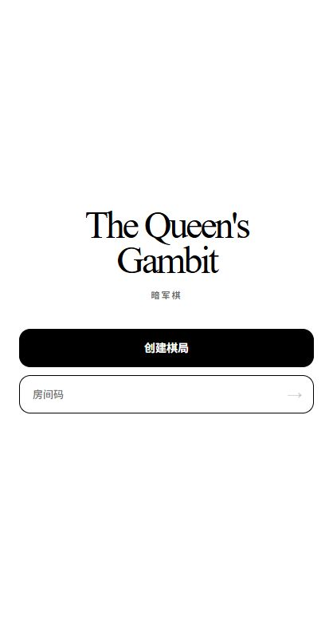
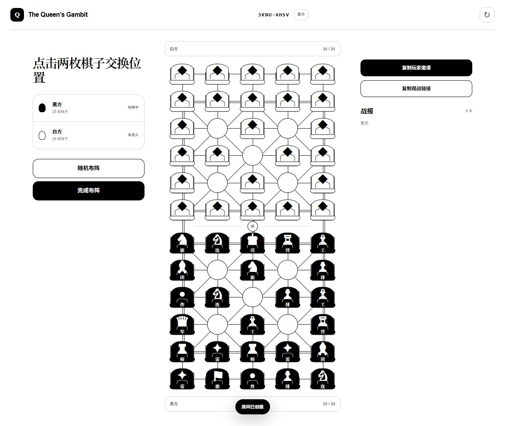
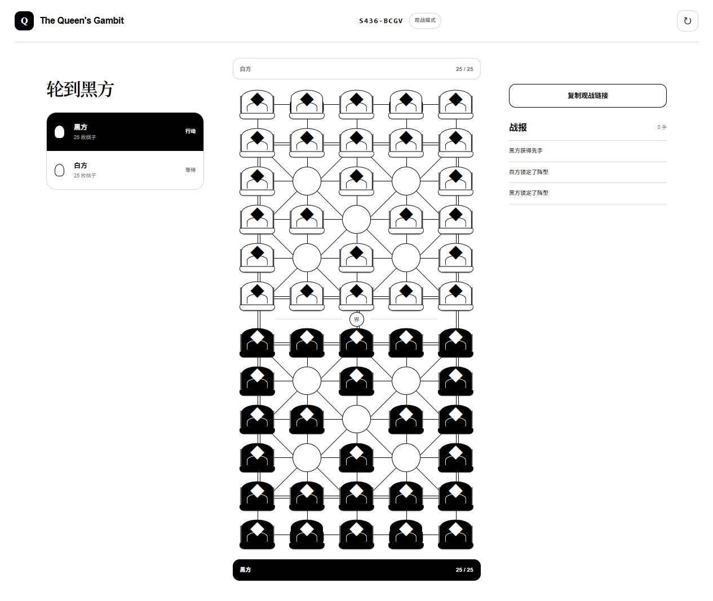

# 军令 · 强化陆战棋

在线二人暗军棋，包含经典模式，以及在经典规则上增加两轮“军令强化”选择的强化模式；同时支持账号、邀请、匹配、棋钟、观战和逐手复盘。

本文中的“海克斯”是开发阶段对强化机制的类比，当前产品和代码统一称为“军令”或“强化牌”，不是棋盘上的六边形坐标。

## 当前版本

| 项目 | 当前值 |
|---|---|
| 军令目录 | `junqi-augments-v3`；v1 20 张、v2 50 张冻结兼容 |
| 军令数量 | 70 张：黑桃 18、红桃 18、梅花 17、方块 17 |
| 花色意图 | 黑桃 > 红桃 > 梅花 > 方块；这是设计等级，不是当前模拟已经证明的胜率排序 |
| 方式分布 | 主动 28、自动 23、持续 13、布阵 6 |
| 机制参数指纹 | `2918025817` |
| 产品稳定性算法 | `product-stability-v14-v3-no-clock-zero-time-deterministic-ids-slot-stable-drafts` |
| 对局引擎指纹 | `augment-duel-dark-v3:threefold-3:strategic-sha256-v2` |
| 当前结论 | 70 张已进入服务端规则；最终发布回归 242/242 通过，正式四小时持续测试与 Sites 部署仍须基于冻结提交完成 |

`lib/augments.ts` 中的 `AUGMENT_CATALOG` 是运行时权威来源。机制参数指纹只覆盖稳定 ID、花色、次数和结构化效果，不覆盖名称或说明文案；规则改动后应同时更新本 README 和测试记录。

## 强化模式怎么进行

1. 第一轮发生在布阵期。服务器先确定双方共用的花色，再分别给双方独立的三张候选牌。
2. 每名玩家每轮可定向刷新一个槽位一次；看过、刷掉或新刷出的牌都会进入本人本局的 `seen`，之后不再出现。
3. 双方各自锁定一张后同时公开。第一轮的布阵牌会在开局事务中校验并生效。
4. 完成前 9 个全局有效落子后、执行第 10 手前暂停棋钟，进入第二轮三选一。
5. 第二轮花色必须不同于第一轮，并逐张排除 6 张 `setup` 布阵牌；方块剩余 11 张中局牌仍可出现。
6. 第二轮选择限时 45 秒。超时时保留已选项；未选择的一方由服务器确定性锁定当前第一张候选。
7. 主动牌由玩家在合法时机点击使用；自动牌与持续牌由服务器按触发条件结算。旧追加行动牌最多追加一步且不可连锁；其中“胜势推进”允许同一枚棋继续行动，其余旧牌要求换另一枚棋。v3 的“稳步推进”和“出其不意”按各自牌面允许同一枚棋走第二步，但都不能串联其他追加行动。

强化排位的标准棋钟是每方 10 分钟。合法落子扣除思考时间后，若该方剩余时间不高于 5 分钟，则完整返还 5 秒，因此恰好 5:00 会变为 5:05；布阵和第二轮选牌期间暂停对局棋钟，主动放弃追加行动只扣思考时间、不返还这 5 秒。

`junqi-augments-v2` 与 `junqi-augments-v3` 强化对局在第二轮公开后启用三次重复局面和棋。相同已结算战略局面第二次出现时，双方看到公开的 `2/3` 提示；第三次出现立即和棋，排位按双方各 `0.5` 分结算。经典模式和持久化的 v1 强化对局保持原规则，不采用这项裁决。

未登录玩家在同一标签页打开玩家邀请时，客户端只把 URL fragment 中的邀请 secret 暂存在 `sessionStorage`，随后清除 fragment；登录 URL 和服务端渲染 HTML 只携带房间号或无 secret 的重试标记，不包含邀请 secret。登录返回同一标签页后才读取暂存值申领席位并清除；`watch=1` 观战路径不读取、替换或消费玩家邀请。

## 70 张军令与精确参数

“主动”表示玩家选择目标执行，“自动”表示满足条件后由服务器触发，“持续”表示公开后按规则持续生效，“布阵”表示只在第一轮布阵阶段改变合法阵型。次数是本局该牌最多可成功结算的次数；非法动作和失败请求不消耗次数。前 20 张 v1 与前 50 张 v2 的稳定 ID 和语义均被冻结，v3 在其后追加 20 张。

### 黑桃 ♠：最高档，18 张

| # | 稳定 ID | 名称 | 方式 / 次数 | 精确效果 |
|---:|---|---|---|---|
| 1 | `spade-grand-maneuver` | 大迂回 | 主动 ×1 | 任意可移动棋按工兵铁路规则移动，可攻击终点敌子 |
| 2 | `spade-relentless-assault` | 乘胜追击 | 自动 ×1 | 吃子后用另一枚棋追加一次普通行动，不可连锁 |
| 3 | `spade-tactical-retreat` | 金蝉脱壳 | 自动 ×1 | 进攻方本应落败且守方存活时，进攻方退回起点，守方不变 |
| 4 | `spade-total-intelligence` | 洞若观火 | 主动 ×1 | 公开后选择 2 枚敌子，永久获知身份 |
| 5 | `spade-strategic-reserve` | 战略储备 | 自动 ×1 | 回合开始且剩余不足 60 秒时，立即增加 120 秒 |
| 6 | `spade-rail-dominion` | 铁路统御 | 主动 ×3 | 任意可移动棋按工兵铁路规则移动，可攻击终点敌子 |
| 7 | `spade-serpentine-offensive` | 穿云迂回 | 主动 ×2 | 非工兵沿连续铁路最多转 2 次弯，可攻击终点敌子 |
| 8 | `spade-deep-strike` | 长驱突击 | 主动 ×1 | 沿相连公路恰走 3 段，中间为空，可攻击终点敌子 |
| 9 | `spade-global-redeployment` | 全域转进 | 主动 ×3 | 将行营中的可移动棋调至棋盘上任意空行营 |
| 10 | `spade-command-chain` | 连环军令 | 自动 ×3 | 非战斗普通移动后，用另一枚棋追加一次普通行动，不可连锁 |
| 11 | `spade-counteroffensive` | 反攻号角 | 自动 ×3 | 吃子后用另一枚棋追加一次普通行动，不可连锁 |
| 12 | `spade-shadow-retreat` | 影遁 | 自动 ×3 | 任意进攻棋本应落败且守方存活时退回起点 |
| 13 | `spade-supreme-recon` | 天网侦察 | 主动 ×1 | 公开后选择 3 枚敌子，永久获知身份 |
| 14 | `spade-last-headquarters` | 濒死悟道 | 持续 | 另一座大本营未曾被敌方占领时，敌方进攻军旗会消耗行动但双方原位存活，军旗永久公开；另一座大本营一旦失守，吃旗永久解锁 |
| 15 | `spade-cherry-bomb` | 樱桃炸弹 | 持续 | 己方炸弹因战斗阵亡时，移除与其站点直接相连的所有非军旗棋子；被波及的炸弹继续连锁，军旗免疫 |
| 16 | `spade-lightning-doctrine` | 兵贵神速 | 持续 | 除司令、工兵、炸弹、地雷和军旗外，己方棋子战斗军阶升一级；本强化公开后完成第 12 个己方回合时军旗自毁并落败，升阶只影响战斗 |
| 17 | `spade-iron-fortress` | 固若金汤 | 持续 | 己方司令不能移动；除炸弹外，同军阶战斗由己方获胜；双方都有此效果时仍按普通平局结算 |
| 18 | `spade-volatile-mines` | 易燃易爆 | 持续 | 己方地雷免疫工兵拆除；首次受非炸弹攻击时攻击者阵亡、地雷存活并永久公开，第二次双方阵亡；炸弹仍直接同归于尽，命中按棋子 ID 记录 |

### 红桃 ♥：较高档，18 张

| # | 稳定 ID | 名称 | 方式 / 次数 | 精确效果 |
|---:|---|---|---|---|
| 1 | `heart-rail-turn` | 铁路转向 | 主动 ×1 | 非工兵沿连续铁路转 1 次弯，终点必须为空 |
| 2 | `heart-initiative` | 行动先机 | 自动 ×1 | 非战斗普通移动后，用另一枚棋追加一次普通行动，不可连锁 |
| 3 | `heart-remote-exchange` | 远程换防 | 主动 ×1 | 交换任意两枚同军阶、可移动的己方棋子，并消耗本回合 |
| 4 | `heart-bomb-disposal` | 爆破专家 | 自动 ×1 | 工兵主动攻击炸弹时排除炸弹，并存活在目标位置 |
| 5 | `heart-targeted-recon` | 定点侦察 | 主动 ×1 | 公开后选择 1 枚敌子，永久获知身份 |
| 6 | `heart-mobile-rail` | 机动铁军 | 主动 ×2 | 任意可移动棋按工兵铁路规则移动，终点必须为空 |
| 7 | `heart-double-turn` | 双向转轨 | 主动 ×1 | 非工兵沿连续铁路最多转 2 次弯，终点必须为空 |
| 8 | `heart-breakthrough` | 纵队突进 | 主动 ×1 | 沿相连公路恰走 3 段，中间和终点必须为空 |
| 9 | `heart-camp-network` | 行营联络 | 主动 ×1 | 将行营中的可移动棋调至棋盘上任意空行营 |
| 10 | `heart-victory-momentum` | 胜势推进 | 自动 ×1 | 吃子后用同一枚或另一枚棋追加一次普通行动，不可连锁 |
| 11 | `heart-orderly-withdrawal` | 有序撤退 | 自动 ×1 | 连长、排长或工兵进攻落败且守方存活时退回起点 |
| 12 | `heart-wide-recon` | 扇区侦察 | 自动 ×1 | 公开后随机侦察敌方前三排 2 枚棋；各自首次移动后情报失效 |
| 13 | `heart-reserve-clock` | 后备时限 | 自动 ×1 | 回合开始且剩余不足 60 秒时，立即增加 90 秒 |
| 14 | `heart-battalion-ascent` | 步步为营 | 持续 | 每枚原始营长每次成功吃子后公开提升一级战斗军阶，最高师长；原始兵种和移动规则不变 |
| 15 | `heart-heavenly-exchange` | 乾坤挪移 | 主动 ×2 | 交换己方前线三排的一枚非军旗棋子与敌方前线三排的一枚任意存活棋子（包括军旗），不额外公开身份，然后结束回合 |
| 16 | `heart-sacrifice-aura` | 献祭光环 | 持续 | 每累计失去 4 枚己方棋子，所有仍存活的原始排长公开提升一级战斗军阶，最高司令 |
| 17 | `heart-steady-advance` | 稳步推进 | 持续 | 每次普通移动最多走一条相连边，但每回合可进行两次普通移动；可用同一枚或不同棋子，可放弃第二次，不可连锁 |
| 18 | `heart-shadow-redeploy` | 暗度陈仓 | 主动 ×1 | 将己方半场内全部存活的非军旗己子，在它们当前占据的站点集合中重新排列；至少两子换位，然后结束回合 |

### 梅花 ♣：中档，17 张

| # | 稳定 ID | 名称 | 方式 / 次数 | 精确效果 |
|---:|---|---|---|---|
| 1 | `club-forced-march` | 急行令 | 主动 ×1 | 沿相连公路恰走 2 段，中间和终点必须为空 |
| 2 | `club-line-hop` | 越列令 | 主动 ×1 | 沿直线铁路越过恰好 1 枚相邻己棋，落到其后空位 |
| 3 | `club-field-exchange` | 就地换防 | 主动 ×1 | 交换由一条公路相连的两枚可移动己棋，并消耗本回合 |
| 4 | `club-steady-tempo` | 稳扎稳打 | 自动 ×5 | 获得后接下来 5 次己方有效行动各返还 5 秒 |
| 5 | `club-frontline-scout` | 前沿侦察 | 自动 ×1 | 随机侦察敌方前两排 1 枚棋；该棋首次移动后情报失效 |
| 6 | `club-rail-passage` | 铁路通行 | 主动 ×1 | 任意可移动棋按工兵铁路规则移动，终点必须为空 |
| 7 | `club-rail-switch` | 临时转轨 | 主动 ×1 | 连长、排长或工兵沿连续铁路转 1 次弯，终点必须为空 |
| 8 | `club-road-patrol` | 公路巡行 | 主动 ×2 | 沿相连公路恰走 2 段，中间和终点必须为空 |
| 9 | `club-camp-relay` | 行营接力 | 主动 ×2 | 将行营中的可移动棋调至己方半场另一空行营 |
| 10 | `club-local-recon` | 阵前观察 | 自动 ×1 | 随机侦察敌方前三排 1 枚棋；该棋首次移动后情报失效 |
| 11 | `club-pocket-time` | 整备时间 | 自动 ×1 | 本轮强化公开后，立即增加 45 秒 |
| 12 | `club-engineer-oath` | 工兵誓约 | 自动 ×2 | 工兵在非地雷战斗中本应落败时，改为与对手同时移除 |
| 13 | `club-division-sapper` | 狗头军师 | 持续 | 原始师长主动攻击地雷时，拆除地雷并存活在目标位置 |
| 14 | `club-bombardier` | 英勇投弹手 | 自动 ×1 | 首枚参与爆炸战斗的己方炸弹在该次战斗中不阵亡并消灭对手；之后恢复普通炸弹规则，无需预先指定 |
| 15 | `club-surprise-double-move` | 出其不意 | 主动 ×1 | 选择一枚非工兵可移动棋子，使其在本回合连续进行至多两次普通移动；第二次可放弃，不可串联其他追加行动 |
| 16 | `club-bitter-ruse` | 苦肉计 | 主动 ×2 | 弃掉一枚非军旗己子并向双方永久公开其身份；服务器随机向使用者永久侦察敌方前线三排中至多两枚仍未知棋子，然后结束回合 |
| 17 | `club-screened-strike` | 隔山打牛 | 持续 | 原始师长仍可普通空移，但进攻必须与目标隔恰好一枚任意棋子；铁路须直线，公路须相连两段，中间棋子不受影响，其余中间站点为空 |

### 方块 ♦：基础档，17 张

| # | 稳定 ID | 名称 | 方式 / 次数 | 精确效果 |
|---:|---|---|---|---|
| 1 | `diamond-camp-transfer` | 行营转进 | 主动 ×1 | 将行营中的可移动棋调至己方半场另一空行营 |
| 2 | `diamond-forward-bomb` | 前置炸弹 | 布阵 ×1 | 布阵时允许至多 1 枚炸弹放在本方最前排 |
| 3 | `diamond-deep-mine` | 纵深布雷 | 布阵 ×1 | 布阵时允许至多 1 枚地雷放在从本方大本营数第三排 |
| 4 | `diamond-engineer-screen` | 工兵掩护 | 自动 ×1 | 工兵在非地雷战斗中本应落败时，改为与对手同时移除 |
| 5 | `diamond-time-cache` | 机动时间 | 自动 ×1 | 本轮强化公开后，立即增加 20 秒 |
| 6 | `diamond-road-step` | 短促推进 | 主动 ×1 | 连长、排长或工兵沿相连公路恰走 2 段，中间和终点为空 |
| 7 | `diamond-camp-relay` | 营地轮换 | 主动 ×2 | 将行营中的连长、排长或工兵调至己方半场另一空行营 |
| 8 | `diamond-front-watch` | 前哨观察 | 自动 ×1 | 随机侦察敌方最前排 1 枚棋；该棋首次移动后情报失效 |
| 9 | `diamond-pocket-watch` | 怀表 | 自动 ×1 | 本轮强化公开后，立即增加 10 秒 |
| 10 | `diamond-drill` | 计时操演 | 自动 ×5 | 获得后接下来 5 次己方有效行动各返还 2 秒 |
| 11 | `diamond-forward-pair` | 双弹前置 | 布阵 ×1 | 布阵时允许至多 2 枚炸弹放在本方最前排 |
| 12 | `diamond-deep-pair` | 双线布雷 | 布阵 ×1 | 布阵时允许至多 2 枚地雷放在从本方大本营数第三排 |
| 13 | `diamond-camp-assault` | 旅进旅退 | 持续 | 原始旅长可以按原本合法路径进攻行营中的敌子；其他棋子仍不能进攻受行营保护的目标 |
| 14 | `diamond-command-fusion` | 合二为一 | 持续 | 己方军长因任何原因阵亡后，仍存活的己方司令与敌方司令交战时获胜；双方都触发时仍按普通平局结算 |
| 15 | `diamond-deep-breath` | 深呼吸 | 布阵 ×1 | 全部 3 枚地雷都可放在己方后方三排中的任意合法站点 |
| 16 | `diamond-hidden-flag` | 偷梁换柱 | 布阵 ×1 | 军旗可放在己方底线任意站点；军旗仍不能移动，被敌方吃掉时立即落败 |
| 17 | `diamond-engineer-mutiny` | 工兵哗变 | 持续 | 己方司令阵亡后，原始工兵主动攻击敌方司令时将其消灭并存活在目标位置 |

## 当前验证状态

以下记录截至 2026-08-11 ET。`outputs/` 被 Git 忽略；它用于保存本机运行证据，不随源码提交。规则、参数、目录或算法改变后，旧报告与检查点只能作为历史记录，不能混入当前结论。

### 已有证据

- 最终完整回归 242/242 通过：HTML 9 项、TypeScript 230 项、真实集成 3 项；
- production build、全项目 ESLint、`tsc --noEmit --incremental false` 与 `git diff --check` 均通过；
- 三套真实集成各连续运行 4 轮，共 12/12 通过；每轮服务端端口均可重新绑定，结束后孤儿进程为 0；
- 未登录邀请覆盖同一标签页 `sessionStorage` 恢复、邀请 secret 不进入认证 URL 或服务端 HTML，以及 `watch=1` 不读取、不替换、不消费玩家邀请；
- v3 产品稳定性框架统一使用 70 张产品目录、63 张非计时模拟牌、零模拟等待、`clock=null`、`1×3×1` 搜索、单局最多 300 手和确定性棋子 ID；
- 390×844、768×1024、1440×1000 三档界面与关键军令动画已有逐帧截图证据。

在上述自动化和受支持的 Chrome 视口证据范围内没有已知 P0/P1。它仍不替代真人联机、跨浏览器、辅助技术、正式四小时持续测试或生产环境验证。

花色仍以 `黑桃 > 红桃 > 梅花 > 方块` 作为产品设计意图，但机器人胜率、档位点估计或排序不属于发布 gate，也不会触发自动改卡。首批玩家反馈和真实对局数据到齐后，再单独评审强度调整。

发布仍要求在准确的冻结提交上新跑一次连续不少于 4 小时的四 worker 持续测试，并完成一整圈 63 个同花色环形四腿组；随后才能执行公开 Sites 部署与生产邮件身份、匹配、私人房、观战和复盘 QA。持续测试的权威结果写入 `outputs/soak/<run-id>/final.json`；其他本机回归与模拟证据也保留在 `outputs/`。旧版本的长跑不能替代当前冻结提交的 release gate。

真人与浏览器扩展验证边界保持不变：公开测试还要覆盖两名真实玩家加一名真实观众、Safari/Firefox、屏幕阅读器、360px 和 200% 缩放。自动化绿灯只覆盖已测路径，不构成绝对缺陷担保，也不代表已完成公开发布。

## 平衡测试参数与复现

项目要求 Node.js 22 或更高版本。

```powershell
npm install
npm run dev
```

完整代码检查：

```powershell
npm test
npm run lint
npx tsc --noEmit --incremental false
git diff --check
```

产品稳定性 quick 使用 63 张非计时军令组成同花色环形赛程：63 个镜像组，每组四腿；权威状态与确定化世界均为 `clock=null`，模拟思考延迟为 0，搜索为 `1×3×1`，每局安全上限为 300 手。任何对局触顶都记为失败，不能改写为和棋；只有产品引擎裁决的三次重复是正常和棋。

```powershell
node --experimental-transform-types scripts/augment-balance-simulation.ts --mode=quick
```

四小时产品稳定性对弈沿用同一口径并循环环形赛程：

```powershell
node --experimental-transform-types scripts/augment-balance-simulation.ts --mode=soak --duration-minutes=240
```

最终四 worker 验收并行运行 balance、rules、api、animation，并要求源码指纹不变、63/63 eligible 覆盖和至少一整圈环形赛程：

```powershell
powershell -NoProfile -ExecutionPolicy Bypass -File .\scripts\soak\run.ps1
```

7 张计时牌仍属于可玩的 70 张产品目录，只因零时间模拟无法公平表达其价值而排除在随机模拟分母之外；它们继续由定向棋钟、API 和产品规则测试覆盖。所有自动对弈都只允许机器人读取玩家可见投影；镜像组交换黑白和先后手并共享配对 seed。胜率只供观察，不参与验收或自动调牌。

## 文档

- [强化模式完整规格](docs/command-mode.md)
- [产品稳定性模拟](docs/balance-simulation.md)
- [70 张版本验收门槛](docs/augment-50-acceptance.md)
- [四小时持续测试](docs/soak-testing.md)

## 界面

<p align="center">
  
</p>




