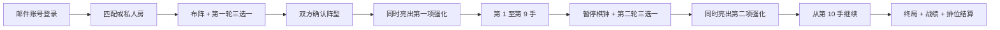

# 强化陆战棋开发规格

状态：实现规格 v3.0（70 张目录）
项目副本：`junqi-command-mode`  
经典基线：`72a52f6d99a9368e25d238efd57841b7152fbe4c`  
产品工作名：强化陆战棋（“海克斯”仅作为机制类比，不作为最终商标或商店名称）

## 1. 不可变前提

本项目是在现有军棋副本上增加新玩法，不重做现有玩法。

- 当前军棋规则、棋盘、布阵限制、碰撞结算、胜负条件和棋子信息规则冻结为“经典模式”。
- 经典模式必须继续使用自己的稳定规则集；强化逻辑不得以条件分支散入经典战斗结算。
- 旧房间、旧复盘和未传模式的旧客户端一律解释为经典模式。
- 强化模式使用独立规则集、状态版本、强化目录版本和复盘版本。
- 账号、匹配、好友、资料页和观战属于两个模式共用的平台层，不得改变经典棋局规则。
- 私人房永远不改变排位分；只有服务器匹配成功并完整结算的排位局才改变分数。

公开入口保留两个清晰选项：

| 入口 | 规则 | 默认 | 排位 |
|---|---|---:|---:|
| 经典模式 | 当前版本原样运行 | 是 | 否（首发） |
| 强化陆战棋 | 经典规则 + 两轮强化选择 | 否 | 是 |

## 2. 一局强化模式的完整流程

### 2.1 第一轮：布阵期选择

- 每名玩家看到自己的三张候选牌；对手和观众看不到候选内容。
- 同一轮双方候选的花色相同，即强化等级相同，但具体三张牌可不同。
- 玩家每轮可指定刷新其中一张，刷新后只有该槽位换牌。
- 每轮每人最多刷新一次；刷新成功不可撤销。
- 本人本局见过的所有候选立即加入 `seen`，包括未选择的牌、被刷掉的牌和刷新得到的新牌。
- 后续抽取不得再出现本人 `seen` 中的任何强化。
- 玩家可在锁定前切换选择；锁定后不可更换。
- 最终确认阵型前必须已经锁定一张强化。
- 第一方确认阵型后，只公开“已确认”；不得公开其强化 ID。
- 双方均确认阵型的同一次服务器状态变更中，同时公开双方第一项强化并开始对局。
- 布阵型强化在最终开局事务中校验和结算，不能在预览、撤销确认或失败请求时提前生效。

### 2.2 第二轮：第 10 手前选择

产品文案使用“第 10 回合强化”；协议以全局有效落子计数为准：完成前 9 手后、执行第 10 手前进入第二轮。若以后改成双方各走九手的完整轮次，必须提升规则版本，不能静默改变旧复盘含义。

- 服务器保存当前行动方和双方剩余时间，然后暂停对局棋钟。
- 双方各自获得新的三选一和一次定向刷新，规则与第一轮相同。
- 第二轮使用与第一轮不同的花色，并在抽取时逐张排除 6 张 `activation=setup` 的布阵专属牌；方块剩余 11 张中局牌仍可进入第二轮。已持久化的 v1 房间继续沿用“第二轮排除整个方块花色”的旧规则，不能静默改写旧局。
- 双方可并行选择；第一方锁定只公开锁定状态。
- 双方均锁定的同一次状态变更中同时公开第二项强化。
- 公开完成后恢复原行动方棋钟，对局从第 10 手继续。
- 第二轮选择固定倒计时为 45 秒。归零时服务器保留本人已选项；尚未选择则从本人当前三个候选中确定性选择第一张并锁定，不重新抽牌，也不泄露对手选择。

### 2.3 抽取与不重复不变量

1. v3 目录共 70 张强化：黑桃 18、红桃 18、梅花 17、方块 17；v1 的 20 张与 v2 的 50 张 ID、语义和持久化解释保持不变。
2. 等级从高到低为：黑桃、红桃、梅花、方块。
3. 每轮先由服务器为房间确定一个双方共用的花色，再分别从双方自己的未见池抽取。
4. 候选必须恰好三张、互不重复、属于本轮花色。
5. 刷新结果必须与当前三张不同，也不能存在于本人 `seen`。
6. 抽到、显示或刷掉即算“见过”；是否选择、是否使用不影响 `seen`。
7. `seen` 按玩家、按房间持久化，刷新页面、重连、换客户端投影都不能清空。
8. 客户端不能上传候选、花色、随机种子或刷新结果。
9. 相同请求重试必须幂等；并发刷新只能成功一次。
10. 第二轮花色不得与第一轮相同，且候选不得包含布阵专属牌；只有 v1 兼容房间继续排除整个方块花色。未知目录版本或池耗尽时失败关闭，不能降级成重复发牌。

### 2.4 v2/v3 三次重复局面和棋

- 这项裁决属于 `junqi-augments-v2` 和 `junqi-augments-v3` 对局。经典模式和已持久化的 v1 强化对局继续按原规则运行，即使反复往返也不会被新版自动判和。
- 计数只在第二轮双方强化已经公开、对局处于稳定 `playing` 阶段时启用。第二轮选牌和待处理侦察阶段不计入重复次数。
- 战略局面包含行动方、棋子身份/存活/位置、军旗公开、已移动棋子、双方装备及次序、触发计数、侦察情报和待执行追加行动；棋钟、手数、事件条数、复盘长度与私有选牌记录不参与等价判断。
- 同一战略局面第三次完整出现时立即结束为 `threefold_repetition` 和棋；事件、复盘、终局状态与棋钟停止必须在同一次权威状态变更中落定。
- 客户端只接收是否启用、公开出现次数和阈值，不接收服务端盐、摘要或完整重复历史。第二次出现时以黑白纸牌样式公开显示“重复局面 · 再次重复即和棋 · `2/3`”，第三次出现后显示和棋原因。
- 排位结算把双方结果都记为 `0.5`，各增加一局排位和一局和棋，不增加胜/负；评分与比赛落库仍使用同一幂等事务。私人房只记录和棋，不改变分数。

## 3. 70 张强化目录

`lib/augments.ts` 中带目录版本的定义是运行时权威来源。v3 目录固定为黑桃 18、红桃 18、梅花 17、方块 17；每张牌包含稳定 ID、名称、短名称、花色、说明、触发时机、使用次数和结构化效果。v1 20 张与 v2 50 张已冻结兼容；已发布 ID 的语义不得原地修改，未来修改需升级目录版本并保证旧复盘仍可解释。

设计边界：

- 强度仅表示同轮抽取等级，不是付费稀有度，也不能出售更强花色。
- 同一轮双方花色相同，保证强度层面对称；具体候选不同，保留适应与反制。
- 强化优先修改移动、布阵、公开信息或一次性战术窗口；少量战斗例外必须是公开、确定且可复盘的规则，不能随机改变结果或重写整张军阶克制表。
- 追加普通行动必须由目录明确规定：旧追加行动牌最多追加一步，除“胜势推进”外要求换另一枚棋；v3 的两张多步牌可按牌面使用同一枚棋完成第二步。所有追加与多步效果都不可串联其他追加行动；禁止无限追加、复活和操纵对手棋钟。除“乾坤挪移”明确规定的换位外，军旗与地雷仍不能在对局中移动。
- 禁止随机免死、随机战斗和随机排雷；所有随机侦察目标只能由服务器抽取并记录证据。
- 一次性强化只有在服务器完成完整合法动作后才标记已用；非法动作、超时、冲突或网络失败均不消耗。
- 被动或整局型强化也必须在状态和复盘中明确记录激活条件，不能只靠当前客户端文案推断。

目录发布检查：

| 花色 | 等级 | 数量 | 抽取约束 |
|---|---|---:|---|
| 黑桃 ♠ | 最高 | 18 | 18；第二轮不重复首轮花色 |
| 红桃 ♥ | 较高 | 18 | 18；第二轮不重复首轮花色 |
| 梅花 ♣ | 中等 | 17 | 17；第二轮不重复首轮花色 |
| 方块 ♦ | 基础 | 17 | 11；逐张排除 6 张布阵专属牌 |

以下 20 张是已发布的 v1 兼容目录；它们在 v2 中原 ID、原语义保留：

| 花色 | 稳定 ID | 名称 | 规则摘要 |
|---|---|---|---|
| 黑桃 | `spade-grand-maneuver` | 大迂回 | 一枚可移动棋按工兵铁路规则行动一次，可攻击终点 |
| 黑桃 | `spade-relentless-assault` | 乘胜追击 | 吃子后用另一枚棋追加一次普通行动，不可连锁 |
| 黑桃 | `spade-tactical-retreat` | 金蝉脱壳 | 进攻方本应被消灭时退回起点，守方不变 |
| 黑桃 | `spade-total-intelligence` | 洞若观火 | 公开后选择两枚敌棋，永久获知身份 |
| 黑桃 | `spade-strategic-reserve` | 战略储备 | 回合开始不足 60 秒时一次增加 120 秒 |
| 红桃 | `heart-rail-turn` | 铁路转向 | 一枚非工兵沿连续铁路转一次弯并落到空位 |
| 红桃 | `heart-initiative` | 行动先机 | 非战斗移动后用另一枚棋追加一次普通行动 |
| 红桃 | `heart-remote-exchange` | 远程换防 | 交换任意两枚同军阶、可移动己棋并消耗回合 |
| 红桃 | `heart-bomb-disposal` | 爆破专家 | 工兵主动攻击炸弹时排除炸弹并留在目标位置 |
| 红桃 | `heart-targeted-recon` | 定点侦察 | 公开后选择一枚敌棋，永久获知身份 |
| 梅花 | `club-forced-march` | 急行令 | 沿相连公路走两段，中间和终点必须为空 |
| 梅花 | `club-line-hop` | 越列令 | 沿直线铁路越过一枚相邻己棋并落到空位 |
| 梅花 | `club-field-exchange` | 就地换防 | 交换由一条公路相连的两枚可移动己棋 |
| 梅花 | `club-steady-tempo` | 稳扎稳打 | 接下来五次己方有效行动各返还 5 秒 |
| 梅花 | `club-frontline-scout` | 前沿侦察 | 随机侦察敌方前两排一枚棋，移动后情报失效 |
| 方块 | `diamond-camp-transfer` | 行营转进 | 将一枚行营己棋调至己方另一空行营 |
| 方块 | `diamond-forward-bomb` | 前置炸弹 | 布阵时允许至多一枚炸弹放在最前排 |
| 方块 | `diamond-deep-mine` | 纵深布雷 | 布阵时允许至多一枚地雷放在本方第三排 |
| 方块 | `diamond-engineer-screen` | 工兵掩护 | 工兵在非地雷战斗中落败时改为同归于尽 |
| 方块 | `diamond-time-cache` | 机动时间 | 公开后立即增加 20 秒 |

v2 在兼容目录上新增以下 30 张；精确次数、距离、时间和目标限制以同版本运行时结构化效果为准：

| 花色 | 稳定 ID | 名称 | 效果类型 |
|---|---|---|---|
| 黑桃 | `spade-rail-dominion` | 铁路统御 | 可攻击的工兵式铁路机动 |
| 黑桃 | `spade-serpentine-offensive` | 穿云迂回 | 可攻击的多次铁路转向 |
| 黑桃 | `spade-deep-strike` | 长驱突击 | 可攻击的长距离公路突进 |
| 黑桃 | `spade-global-redeployment` | 全域转进 | 跨全盘行营调动 |
| 黑桃 | `spade-command-chain` | 连环军令 | 非战斗移动后的追加行动 |
| 黑桃 | `spade-counteroffensive` | 反攻号角 | 吃子后的追加行动 |
| 黑桃 | `spade-shadow-retreat` | 影遁 | 进攻落败时撤回起点 |
| 黑桃 | `spade-supreme-recon` | 天网侦察 | 多目标永久侦察 |
| 红桃 | `heart-mobile-rail` | 机动铁军 | 非攻击工兵式铁路机动 |
| 红桃 | `heart-double-turn` | 双向转轨 | 非攻击多次铁路转向 |
| 红桃 | `heart-breakthrough` | 纵队突进 | 非攻击长距离公路突进 |
| 红桃 | `heart-camp-network` | 行营联络 | 跨全盘行营调动 |
| 红桃 | `heart-victory-momentum` | 胜势推进 | 吃子后的灵活追加行动 |
| 红桃 | `heart-orderly-withdrawal` | 有序撤退 | 低阶进攻棋撤回起点 |
| 红桃 | `heart-wide-recon` | 扇区侦察 | 多目标临时前线侦察 |
| 红桃 | `heart-reserve-clock` | 后备时限 | 低时间救援 |
| 梅花 | `club-rail-passage` | 铁路通行 | 单次非攻击工兵式铁路机动 |
| 梅花 | `club-rail-switch` | 临时转轨 | 低阶棋单次铁路转向 |
| 梅花 | `club-road-patrol` | 公路巡行 | 多次短距离公路机动 |
| 梅花 | `club-camp-relay` | 行营接力 | 多次己方半场行营调动 |
| 梅花 | `club-local-recon` | 阵前观察 | 临时前线侦察 |
| 梅花 | `club-pocket-time` | 整备时间 | 公开后棋钟加时 |
| 梅花 | `club-engineer-oath` | 工兵誓约 | 多次工兵绝命战斗 |
| 方块 | `diamond-road-step` | 短促推进 | 低阶棋短距离公路机动 |
| 方块 | `diamond-camp-relay` | 营地轮换 | 低阶棋己方半场行营调动 |
| 方块 | `diamond-front-watch` | 前哨观察 | 最前排临时侦察 |
| 方块 | `diamond-pocket-watch` | 怀表 | 小额即时棋钟加时 |
| 方块 | `diamond-drill` | 计时操演 | 多步小额棋钟返还 |
| 方块 | `diamond-forward-pair` | 双弹前置 | 布阵时放宽两枚炸弹位置 |
| 方块 | `diamond-deep-pair` | 双线布雷 | 布阵时放宽两枚地雷位置 |

v3 在冻结的 v2 目录后新增以下 20 张。表内是当前最终语义，不以模拟胜率自动改写：

| 花色 | 稳定 ID | 名称 | 方式 / 次数 | 精确最终语义 |
|---|---|---|---|---|
| 黑桃 | `spade-last-headquarters` | 濒死悟道 | 持续 | 另一座大本营未曾被敌方棋子占领时，敌方进攻军旗会触发保护：本次行动照常消耗，双方原位存活，军旗永久公开；另一座大本营一旦失守，吃旗永久解锁 |
| 黑桃 | `spade-cherry-bomb` | 樱桃炸弹 | 持续 | 己方炸弹因战斗阵亡时，移除与其站点直接相连的所有非军旗棋子；被波及的炸弹继续连锁，军旗免疫 |
| 黑桃 | `spade-lightning-doctrine` | 兵贵神速 | 持续 | 除司令、工兵、炸弹、地雷和军旗外，己方棋子战斗军阶升一级；本强化公开后完成第 12 个己方回合时军旗自毁并落败，升阶只影响战斗 |
| 黑桃 | `spade-iron-fortress` | 固若金汤 | 持续 | 己方司令不能移动；除炸弹外，同军阶战斗由己方获胜；双方都有此效果时仍按普通平局结算 |
| 黑桃 | `spade-volatile-mines` | 易燃易爆 | 持续 | 己方地雷免疫工兵拆除；首次受非炸弹攻击时攻击者阵亡、地雷存活并永久公开，第二次双方阵亡；炸弹仍直接同归于尽，命中按棋子 ID 记录 |
| 红桃 | `heart-battalion-ascent` | 步步为营 | 持续 | 每枚原始营长每次成功吃子后公开提升一级战斗军阶，最高师长；原始兵种和移动规则不变 |
| 红桃 | `heart-heavenly-exchange` | 乾坤挪移 | 主动 ×2 | 交换己方前线三排的一枚非军旗棋子与敌方前线三排的一枚任意存活棋子（包括军旗），不额外公开身份，然后结束回合 |
| 红桃 | `heart-sacrifice-aura` | 献祭光环 | 持续 | 每累计失去 4 枚己方棋子，所有仍存活的原始排长公开提升一级战斗军阶，最高司令 |
| 红桃 | `heart-steady-advance` | 稳步推进 | 持续 | 每次普通移动最多走一条相连边，但每回合可进行两次普通移动；可用同一枚或不同棋子，可放弃第二次，不可连锁 |
| 红桃 | `heart-shadow-redeploy` | 暗度陈仓 | 主动 ×1 | 将己方半场内全部存活的非军旗己子，在它们当前占据的站点集合中重新排列；至少两子换位，然后结束回合 |
| 梅花 | `club-division-sapper` | 狗头军师 | 持续 | 原始师长主动攻击地雷时，拆除地雷并存活在目标位置 |
| 梅花 | `club-bombardier` | 英勇投弹手 | 自动 ×1 | 首枚参与爆炸战斗的己方炸弹在该次战斗中不阵亡并消灭对手；之后恢复普通炸弹规则，无需预先指定 |
| 梅花 | `club-surprise-double-move` | 出其不意 | 主动 ×1 | 选择一枚非工兵可移动棋子，使其在本回合连续进行至多两次普通移动；第二次可放弃，不可串联其他追加行动 |
| 梅花 | `club-bitter-ruse` | 苦肉计 | 主动 ×2 | 弃掉一枚非军旗己子并向双方永久公开其身份；服务器随机向使用者永久侦察敌方前线三排中至多两枚仍未知棋子，然后结束回合 |
| 梅花 | `club-screened-strike` | 隔山打牛 | 持续 | 原始师长仍可普通空移，但进攻必须与目标隔恰好一枚任意棋子；铁路须直线，公路须相连两段，中间棋子不受影响，其余中间站点为空 |
| 方块 | `diamond-camp-assault` | 旅进旅退 | 持续 | 原始旅长可以按原本合法路径进攻行营中的敌子；其他棋子仍不能进攻受行营保护的目标 |
| 方块 | `diamond-command-fusion` | 合二为一 | 持续 | 己方军长因任何原因阵亡后，仍存活的己方司令与敌方司令交战时获胜；双方都触发时仍按普通平局结算 |
| 方块 | `diamond-deep-breath` | 深呼吸 | 布阵 ×1 | 全部 3 枚地雷都可放在己方后方三排中的任意合法站点 |
| 方块 | `diamond-hidden-flag` | 偷梁换柱 | 布阵 ×1 | 军旗可放在己方底线任意站点；军旗仍不能移动，被敌方吃掉时立即落败 |
| 方块 | `diamond-engineer-mutiny` | 工兵哗变 | 持续 | 己方司令阵亡后，原始工兵主动攻击敌方司令时将其消灭并存活在目标位置 |

每张强化在进入公开目录前必须有：规则单测、服务器非法输入测试、棋钟测试、并发单次消耗测试、复盘逐帧测试、移动端交互测试和至少一组对抗模拟。未经这些检查的定义只能留在开发目录，不能进入匹配池。

## 4. 牌桌与选择 UI

### 4.1 扑克牌表现

- 强化以竖向扑克牌呈现；左上和右下显示花色，中央显示名称、效果摘要和等级。
- 四种花色全部使用暖白纸面、黑色线条和灰阶状态；红桃与方块不使用红色。花色只通过 `♠ ♥ ♣ ♦`、中文等级和边框纹样表达，状态不能只靠明暗或颜色区分。
- 所有视觉元素保持纸牌与棋盘的平面线稿语言；不得混入照片、金属、火焰照片、木纹或其他真实世界材质。
- 候选牌必须同时显示名称、效果、使用时机和是否一次性。
- 选中、锁定、未公开、可用、启用和已使用分别有可读文字与无障碍状态。
- 未公开牌使用统一牌背，不在 DOM、无障碍名称、属性或网络投影中携带真实 ID 与说明。
- 已使用牌保留在牌桌边并加“已使用”印章，不突然消失。
- 自动效果授予追加行动后，玩家可以按牌面完成普通移动，也可以主动放弃；放弃公开记录对应军令，但不增加全局手数、不添加落子回放，也不触发落子增益。棋钟仍结算从追加行动开始到放弃之间的思考时间。

### 4.2 选择交互

- 三张牌使用单选组语义；方向键、Home、End、Enter 和 Space 可完成选择。
- 三张候选按 70–110ms 错峰从屏幕下方弹入；锁定后两张未选牌淡出，选中牌移到中央，再围绕 Y 轴完成 720° 双转并在背面阶段显示原创黑白几何牌背。
- 服务器确认成功后，选中牌按实际牌盒 DOM 坐标缩放归档到本人左侧强化栏；快速成功、慢响应、8 秒等待、409 幂等重拉和重连都不能让动画层永久滞留或重复归档。
- 每张候选旁有“刷新这张”，触摸目标至少 44×44 CSS 像素。
- 刷新前文案明确“刷新后本局不会再出现”；请求进行中禁用重复提交。
- 锁定使用独立按钮，结果通过 `aria-live` 宣布。
- 断线重连后恢复本人候选、`seen`、刷新使用状态、选择与锁定状态。
- 尊重 `prefers-reduced-motion`；揭示动画不是理解状态的唯一途径。
- 390×844、768×1024 和 1440×1000 布局均须完整显示三选一、刷新、锁定和等待状态，无横向页面溢出。

### 4.3 牌桌边强化栏

- 双方强化牌固定显示在各自棋钟或玩家条旁，最多两张。
- 双方公开后，所有玩家和合法观众都能看到双方已选择的强化名称与是否已用。
- 本人未使用且正处于合法发动时机的主动牌本身就是按钮；对手牌、自动牌和未到时机的牌只读并显示原因。
- 启用一次性强化后必须有明确取消入口；服务器成功前不能乐观显示“已使用”。
- Escape、再次点击当前牌或“取消”按钮均可退出启用态。
- 一次性牌从可用变为耗尽时播放灰阶烧边、方形火星和抽象灰烬消散；多充能牌只更新“已触发 n/N”，不得在第一次触发时误烧。动效不使用真实火焰照片或拟真材质。
- 战报与复盘同一手显示强化名称、动作路径和消耗状态。

## 5. 账号、身份和个人资料

公开 Sites 地址可直接访问入口，但所有游玩、匹配、私人房邀请和好友观战都要求先通过 Sites 邮件身份登录：

- 服务端以可信的 `oai-authenticated-user-id` 作为不可变账号主键。
- `oai-authenticated-user-email` 只用于显示和联系；首次可信访问自动创建资料。
- 不在游戏内自建密码、验证码或密码重置系统，也不信任客户端自行提交的邮箱。
- 会话、房间席位、匹配和动作都绑定服务器账号 ID；旧的匿名席位令牌不得作为排位身份。
- 邮箱只向本人显示；其他玩家看到可修改的显示名和安全头像。
- 未登录玩家邀请中的 secret 只存在于 URL fragment，并由客户端暂存在同一标签页的 `sessionStorage`；fragment 随即从地址栏清除。认证 URL 与服务端渲染 HTML 只携带房间号、`watch=1` 或无 secret 的重试标记，绝不包含邀请 secret。
- 登录返回同一标签页后，客户端才读取暂存邀请申领席位，成功或确认终态后清除；若浏览器禁用该存储，则明确要求登录后重新打开原邀请，不能静默降级为观战。`watch=1` 只保留观战意图，不读取、覆盖或消费待用的玩家邀请。

个人资料至少显示：

- 当前段位、分数和段位进度。
- 全模式已结算对局的胜场、负场、和棋、总场次与胜率；排位局数和排位分另行保存，私人房不改变排位分。
- 最近 10 局当前显示对手显示名、胜/负/和、三次重复和棋原因（适用时）、分数变化和完成日期。
- 模式、先后手、双方公开强化、安全复盘入口和私人房“非排位”标签属于后续历史页扩展，当前 UI 不声称已经显示这些字段。已完成私人房可进入最近 10 局和总战绩，但不改变排位分。
- 中止、服务器取消、作弊冻结和未结算对局使用独立状态，不能伪算胜负。

首发范围包括好友请求与列表、在线状态和安全观战，并且不允许仅凭猜测账号 ID 读取状态。拉黑、隐身和用户级观战关闭列入公开测试后的隐私扩展；在这些开关完成前，匹配观战始终使用服务端安全投影，不能切换为明牌。

## 6. 在线匹配、棋钟和段位

### 6.1 匹配

- 在线玩家可进入“强化排位”队列；服务器按分数区间、等待时长和连接地区逐步扩展搜索。
- 同一账号只能存在一个有效排位队列项或一局进行中的排位对局。
- 匹配成功后创建服务器权威房间，不能改成私人明牌观战，也不能替换对手。
- 断线提供有限重连窗口；主动退出、超出重连窗口或棋钟归零按规则判负。
- 首发以服务器身份绑定、单账号单队列和幂等结算作为基础边界；高频重复对手、同源异常和无有效落子短局的自动冻结列入公开测试后的风控扩展，未完成前不得宣称具备完整反刷分能力。

### 6.2 标准棋钟

强化排位固定使用：

- 每方初始 `600000ms`，即 10:00。
- 只在轮到本人时计时；布阵期和第二轮强化选择期不计入对局棋钟。
- 服务器收到合法落子时先扣除本次思考时间。
- 若扣除后该方剩余时间不高于 `300000ms`，再增加 `5000ms`。
- 这 `5000ms` 必须完整加入且不在 `300000ms` 封顶：扣时后恰好 `300000ms` 变为 `305000ms`，`299000ms` 变为 `304000ms`。
- 追加行动的主动放弃只结算思考时间，不属于合法落子，因此不触发排位加秒；若同一步还触发军令棋钟返还，两种加时依次完整叠加。
- 为避免热部署中途改变既有对局，缺少新制标记的旧持久化排位房继续沿用 `300000ms` 上限；新建排位房显式采用不封顶规则。
- 非法请求、刷新、聊天、确认弹窗和重试不加秒。
- 归零先于动作结算；归零动作不执行，也不消耗强化。
- 服务器时间是唯一真值，客户端只做平滑显示和重连校准。

### 6.3 段位

段位参考《英雄联盟》的可理解层级，但分数由本游戏独立计算，不复制其商标、图标或隐藏公式：

`黑铁 → 青铜 → 白银 → 黄金 → 铂金 → 翡翠 → 钻石 → 大师 → 宗师 → 王者`

- 钻石及以下每级分 IV、III、II、I；大师及以上按赛季排行榜分数排序。
- 新账号先进行定级局；定级期间仍记录原始比赛和对手强度。
- 结算基于双方赛前评分、比赛结果和可信度，不能由客户端上传分数变化。
- 胜利加分、失败扣分；超时和主动退出按负局处理；服务器取消不改变分数。
- v2/v3 三次重复局面按双方各 `0.5` 的和棋分结算；评分变化仍由双方赛前评分决定，不能把“和棋”错误写成固定零分变化。
- 分数更新与比赛落库必须是同一幂等事务，重复回调不能重复加减。
- 赛季重置、衰减、晋级保护和大师以上名额属于可配置策略，发布前必须在规则页公开。
- 私人房、开发房、明牌观战房和机器人模拟全部排除在排位分、排位局数与正式强化平衡样本之外；已完成的私人房仍进入个人最近战绩与全模式胜率，分数变化固定为 0。

## 7. 私人房、邀请与观战

### 7.1 私人房

- 房主可选择经典模式或强化模式，并邀请好友加入。
- 房间必须明确标注“非排位”；结果不改变排位分。
- 房主在开局前设置观战信息级别，开局后不得提高可见性。
- 默认安全设置为“隐藏双方暗子”。可选“明牌观战”仅适用于私人非排位房，并在双方玩家加入前清楚展示。
- 邀请链接只授予进入房间的能力，不授予玩家席位、好友关系或明牌权限；服务器仍检查登录身份和房间策略。

### 7.2 好友观战匹配局

- 首发版中，已互为好友且不是对局参与者的账号可观战正在进行的匹配局；拉黑、隐身和用户级观战关闭属于后续隐私扩展，当前不作为已实现能力。
- 匹配观战绝不能暴露对手暗子；推荐只显示公共棋盘信息和被观战好友本来可见的己方信息。
- 不返回对手隐藏棋型、私有候选、未公开选择、完整初始阵型或可逐帧反推出身份的数据。
- 已公开的双方强化牌和公开战报可见。
- 终局后的复盘按产品隐私策略开放；进行中不得通过复盘 API、缓存、可访问性文本或 WebSocket 旁路泄密。

### 7.3 私人明牌观战

- 仅当房主开局前选择“观众可见双方暗子”且房间明确为私人非排位时允许。
- 所有加入者和双方玩家都看到持续警示；该局永久标记为明牌观战。
- 明牌观战局不进入排位、排位局数、强化平衡样本或公开排行榜；仍可进入双方个人最近战绩与全模式胜率，分数变化固定为 0。
- 观战权限由服务器投影，不能依赖客户端把棋子用 CSS 遮住。

## 8. 权威状态、接口和复盘

状态至少区分：

| 领域 | 必要字段 |
|---|---|
| 兼容 | 状态结构版本、规则集 ID、经典/强化模式 |
| 强化目录 | 目录版本、70 张稳定定义及 v1 20 张、v2 50 张兼容池 |
| 选择轮次 | 轮次、触发点、共享花色、候选、刷新槽位、选择、锁定、公开 |
| 不重复 | 按阵营保存的 `seen` 集合 |
| 装备栏 | 每方最多两张、可用/已用、使用手数与证据 |
| 对局 | 棋盘、行动方、有效落子数、棋钟基准、阶段 |
| 重复局面 | v2/v3 规则指纹、公开出现次数、阈值、终局和棋原因 |
| 观战 | 房间类型、可见性策略、投影视角 |
| 结算 | 比赛 ID、结果、结束原因、评分前后值、幂等键 |

### 8.1 保密投影

- 数据库存储完整权威状态；每次读取都按本人、对手、匹配观众、私人安全观众、私人明牌观众和终局复盘分别投影。
- 公开前，对手候选和选择不能出现在响应、事件、错误信息、日志、HTML、缓存键或无障碍名称中。
- 第一方锁定只公开布尔值；双方锁定后一次性公开双方选中的 ID。
- 匹配观众永远不能使用明牌投影。
- 投影测试必须扫描完整序列化响应，而不仅检查 UI 是否隐藏。

### 8.2 并发与幂等

- 选牌、刷新、锁定、确认阵型、强化动作、普通落子和评分结算都使用预期版本或等效 compare-and-set。
- 刷新与替换牌、更新 `seen`、扣除刷新次数必须原子完成。
- 强化动作与棋子变化、棋钟、换边、使用状态和复盘步骤必须原子完成。
- 成功响应丢失后，重拉状态应能确认结果；客户端不得盲目重复落子或再次消耗。
- 未知规则版本、未知目录版本、字段矛盾或更高版本状态必须失败关闭或只读，不能自动“修好”后覆盖。

### 8.3 Replay V2

完整复盘头部保存规则集、状态结构版本、目录版本、两轮花色、双方候选历史、刷新、最终选择、公开时点、最终布阵和观战策略。每个步骤至少保存：

- 连续手数、行动方、服务器时间与动作类型。
- 普通移动或强化 ID、起点、终点、必要中间路径与战斗结果。
- 动作前后双方棋钟和强化可用状态。
- 第二轮暂停、锁定、公开与恢复时点。
- v2/v3 重复局面的公开计数、`draw_repetition` 事件与三次重复终局原因；经典和 v1 复盘不得被新版补判和棋。
- 终局结果、结束原因和排位结算引用。

播放器按保存版本重建事实，不调用“今天最新版”规则重新裁决旧步骤。旧经典复盘通过适配器继续显示；无法补齐的信息明确标记为部分复盘。

## 9. 测试与平衡验证

发布质量不能靠绝对保证。首次公开上线测试的门槛定义为：当前自动化与受支持的 Chrome 视口矩阵通过、在对应证据范围内无已知 P0/P1 缺陷、所有已知 P2 有明确处置，并具备监控和回滚。任何身份泄露、重复结算、经典规则回归或复盘不可还原都阻止上线。真实多人、扩展浏览器和辅助技术矩阵属于公开测试后的扩展验证，不能被写成首次上线前已经完成的证据。

### 9.1 代码测试

- 经典规则全量回归：布阵、道路、铁路、行营、大本营、战斗、军旗、胜负、棋钟和旧复盘。
- 70 张强化逐张覆盖合法、非法、边界、并发、超时、次数消耗和规则组合；v1 20 张与 v2 50 张另做持久化快照兼容回归。
- 抽取性质测试：每轮三张、同花色、双方同等级、刷新不重复、`seen` 永不回退、第二轮不同花色。
- 投影测试：每种视角逐字段验证，进行中匹配观战零暗子泄露。
- 账号、资料、最近 10 局、胜率、好友权限、匹配队列和分数幂等集成测试。
- API 模糊输入、长度上限、伪造身份、越权观战、重放请求和并发事务测试。

### 9.2 玩家流程与 UI 测试

当前已有的界面证据范围：

- Chrome 下的 1440×1000、768×1024、390×844 三档逐帧截图；
- 两轮选择、三牌入场、锁定淡出、720° 翻牌、入盒、牌边展示、一次性焚毁与安全观战投影；
- 自动化状态机与 `prefers-reduced-motion` 路径，以及目标代码回归、类型检查和静态检查。

以下属于公开上线后的扩展验证，不得写成当前已经完成的上线证据：

- 两名真实玩家和一名真实观众，使用独立账号走通注册、匹配、两轮选择、刷新、锁定、布阵、公开、使用、断线、重连、终局、资料和复盘；
- 私人房真人分别验证安全观战和双方明牌观战，确认开局后不能提高权限；
- Safari、Firefox、屏幕阅读器，以及完整鼠标、键盘和触摸组合；
- 360px 窄屏、200% 缩放、系统大字体；
- 网络节流、丢包、重复响应、跨标签页、后台恢复和时钟漂移的真实环境测试。

上述扩展验证若发现 P0/P1、隐藏信息泄露或无法完成核心流程，必须立即熔断受影响入口并修复；它不是可以被省略的质量工作，只是不冒充首次公开测试前已取得的证据。

### 9.3 玩家平衡观察

- 自动对局优先验证功能、隐私、终局、回放和长期运行稳定，不把胜率或档位排序设为发布 gate。
- 单牌选择率、刷新率、使用率、先后手胜率和组合表现只作为观察数据，不生成自动调牌建议。
- `黑桃 > 红桃 > 梅花 > 方块` 是产品设计意图，当前不宣称机器人样本已经证明严格经验排序。
- 第一批玩家反馈和真实对局数据到齐后再评审强度；若修改，必须产生新目录版本，旧局与旧复盘继续使用原定义。

### 9.4 模拟与压力测试

- 使用确定性随机种子进行至少百万次发牌模拟，证明无重复、无池耗尽、双方等级一致且分布均匀。
- 使用规则机器人或合法动作枚举做长局、无棋可走、组合强化和终局状态遍历。
- 并发模拟匹配、刷新、锁定、双方同时落子、断线恢复和重复结算。
- 压力测试同时在线、匹配队列、轮询或实时连接、资料读取和复盘写入；明确容量与降级策略。
- 安全测试重点覆盖账号头伪造、对象级越权、观战泄密、邀请枚举、分数重放和服务端随机性。

### 9.5 截至 2026-08-11 ET 的冻结证据

- 最终完整回归 266/266 通过：HTML 9 项、集成服务器契约 4 项、TypeScript 250 项、真实集成 3 项；production build、全项目 ESLint、`tsc --noEmit --incremental false` 与 `git diff --check` 通过。
- 三套真实集成各连续执行 4 轮，共 12/12 通过；每轮服务端端口可重新绑定，结束后孤儿进程为 0。
- API 集成在同一隔离工作区连续执行 64/64 次且零自动重试，全部返回 JSON、64 个动态端口均可重绑、D1 文件与 Vinext/Workerd 残留均为 0；独立双启动哨兵验证显式持久状态可在停服后读回并安全清理。
- 未登录玩家邀请已覆盖同标签页 `sessionStorage` 恢复、认证 URL/服务端 HTML 无 secret，以及 `watch=1` 不读取、不替换、不消费玩家邀请。
- 当前产品稳定性算法为 `product-stability-v17-v3-no-clock-zero-time-deterministic-ids-slot-stable-drafts-relocation-aware-public-rank-capacity-worlds-private-draft-fidelity`，产品引擎指纹为 `augment-duel-dark-v3:threefold-3:strategic-sha256-v3`。v17 只从玩家可见投影、公开闪电战状态和公开晋升标记构造候选域，在标准库存容量内抽取基础军阶后独立生成当前有效军阶；对手已锁但未共同公开的卡仅从合成选项加入内部 loadout，公开前 trigger 为 0 且 unused。它不读取权威 `baseTypes`、私有选牌或回放私密信息，并对每个 v3 抽样世界执行规则校验和重投影一致性检查。只有敌方棋子进入守方大本营才会解锁“濒死悟道”；旧 v16 算法和旧引擎 checkpoint 不可恢复。
- 产品目录共 70 张；自动模拟使用 63 张非计时军令、`clock=null`、零模拟等待、`1×3×1` 搜索、同花色环形四腿赛程和单局 300 手安全上限。任一触顶即失败，不能伪装成和棋。
- 在当前自动化与受支持的 Chrome 视口证据范围内没有已知 P0/P1。正式连续不少于 4 小时的四 worker soak 与公开 Sites 部署仍是冻结提交之后的 release gate；权威长跑结果写入 `outputs/soak/<run-id>/final.json`，本机其他证据保留在 `outputs/`。

上述证据不能替代真人暗棋盲测、Safari/Firefox、辅助技术或生产环境 QA；它只覆盖已测路径，不构成绝对缺陷担保，也不代表已完成公开发布。

## 10. 上线顺序与熔断

1. 冻结经典模式基线，建立行为回归快照。
2. 完成账号、资料和权限边界，但先不开放排位。
3. 内部房启用 70 张 v3 目录、两轮选择、v1/v2 兼容恢复和安全观战。
4. 自动测试与 Chrome 三档主视口矩阵通过，冻结首次公开测试候选提交。
5. 机器人模拟、压力与安全测试通过。
6. 覆盖公开地址进入、邮件身份和安全观战的生产烟雾测试。
7. 在公开测试中安排三人真实浏览器流程、Safari/Firefox、360px、200% 缩放与辅助技术扩展验证。
8. 根据公开测试证据核对理解度、断线率、选牌完成率、隐私和明显失衡。
9. 仅在扩展验证和分数影子结算可信后扩大排位范围，并保留独立关闭强化匹配、排位结算和新房创建的开关。

立即熔断条件：

- 经典模式规则或旧房间被强化版本改变。
- 对手候选、暗子或完整复盘在非法视角泄露。
- 一次动作多次消耗、重复落子、重复评分或评分与比赛结果不一致。
- 时钟可被客户端操纵或超时后仍成功行动。
- 目录版本无法解释正在进行的房间或历史复盘。
- UI 使玩家无法选择、刷新、锁定、确认或取消一次性强化。

熔断时禁止创建新的受影响房间和新的排位结算，不删除进行中状态；按保存版本完成、只读或人工裁决。回滚 UI 入口不等于删除旧规则解释器。

## 11. 完成定义

只有以下条件同时满足，才能称为首发功能完成：

- 经典模式默认、现有规则与显示无回归。
- 70 张强化均属于正确花色且有完整规则、服务器实现和逐张测试；v1 20 张与 v2 50 张旧房间仍按各自冻结目录恢复与回放。
- 第一轮在布阵期可选，双方确认阵型后同时公开。
- 第 10 手前第二轮正确暂停、选择、公开并恢复棋钟与行动方。
- 每轮每人三选一、只刷新一张，所有见过与刷掉的牌本局不再出现。
- 双方每轮抽取等级相同，且抽取、刷新、重连和并发结果由服务器裁决。
- 双方强化以扑克牌形式稳定显示在牌桌边，公开、隐藏、启用和已用状态清楚且可访问。
- 所有玩家使用邮件身份登录；资料页胜率与最近 10 局准确可复核。
- 在线匹配、10 分钟与最后 5 分钟每步 5 秒的棋钟、段位和幂等结算完成。
- 好友观战匹配局不暴露对手暗子；私人房可在开局前选择双方明牌观战且永不计排位。
- 首次公开测试前，完整代码检查、产品稳定性模拟、压力、安全、Chrome 390×844 / 768×1024 / 1440×1000 视觉回归均达到各自门槛；真实三人、Safari/Firefox、屏幕阅读器、360px 和 200% 缩放保留为公开测试后的扩展验证，不能伪写为已完成。
- 在首次公开测试前的自动化与受支持视口证据范围内无已知 P0/P1 缺陷，并具备生产监控、版本兼容、熔断与回滚能力。
