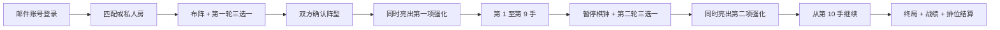

# 强化陆战棋开发规格

状态：实现规格 v1.0  
项目副本：`junqi-command-mode`  
经典基线：`72a52f6d99a9368e25d238efd57841b7152fbe4c`  
产品工作名：强化陆战棋（“海克斯”仅作为机制类比，不作为最终商标或商店名称）

## 1. 不可变前提

本项目是在现有军棋副本上增加新玩法，不重做现有玩法。

- 当前军棋规则、棋盘、布阵限制、碰撞结算、胜负条件和棋子信息规则冻结为“经典模式”。
- 经典模式必须继续使用自己的稳定规则集；强化逻辑不得以条件分支散入经典战斗结算。
- 旧房间、旧复盘和未传模式的旧客户端一律解释为经典模式。
- 强化模式使用独立规则集、状态版本、强化目录版本和复盘版本。
- 账号、匹配、好友、资料页和观战属于两个模式共用的平台层，不得改变经典棋局规则。
- 私人房永远不改变排位分；只有服务器匹配成功并完整结算的排位局才改变分数。

公开入口保留两个清晰选项：

| 入口 | 规则 | 默认 | 排位 |
|---|---|---:|---:|
| 经典模式 | 当前版本原样运行 | 是 | 否（首发） |
| 强化陆战棋 | 经典规则 + 两轮强化选择 | 否 | 是 |

## 2. 一局强化模式的完整流程

### 2.1 第一轮：布阵期选择

- 每名玩家看到自己的三张候选牌；对手和观众看不到候选内容。
- 同一轮双方候选的花色相同，即强化等级相同，但具体三张牌可不同。
- 玩家每轮可指定刷新其中一张，刷新后只有该槽位换牌。
- 每轮每人最多刷新一次；刷新成功不可撤销。
- 本人本局见过的所有候选立即加入 `seen`，包括未选择的牌、被刷掉的牌和刷新得到的新牌。
- 后续抽取不得再出现本人 `seen` 中的任何强化。
- 玩家可在锁定前切换选择；锁定后不可更换。
- 最终确认阵型前必须已经锁定一张强化。
- 第一方确认阵型后，只公开“已确认”；不得公开其强化 ID。
- 双方均确认阵型的同一次服务器状态变更中，同时公开双方第一项强化并开始对局。
- 布阵型强化在最终开局事务中校验和结算，不能在预览、撤销确认或失败请求时提前生效。

### 2.2 第二轮：第 10 手前选择

产品文案使用“第 10 回合强化”；协议以全局有效落子计数为准：完成前 9 手后、执行第 10 手前进入第二轮。若以后改成双方各走九手的完整轮次，必须提升规则版本，不能静默改变旧复盘含义。

- 服务器保存当前行动方和双方剩余时间，然后暂停对局棋钟。
- 双方各自获得新的三选一和一次定向刷新，规则与第一轮相同。
- 第二轮使用与第一轮不同的花色，并排除含布阵专属牌的方块；这既避免第 10 手抽到无法生效的布阵牌，也保证每个五张花色池在一轮“三张 + 一次刷新”后不会因 `seen` 耗尽。
- 双方可并行选择；第一方锁定只公开锁定状态。
- 双方均锁定的同一次状态变更中同时公开第二项强化。
- 公开完成后恢复原行动方棋钟，对局从第 10 手继续。
- 第二轮选择固定倒计时为 45 秒。归零时服务器保留本人已选项；尚未选择则从本人当前三个候选中确定性选择第一张并锁定，不重新抽牌，也不泄露对手选择。

### 2.3 抽取与不重复不变量

1. 目录共 20 张强化，四个花色各 5 张。
2. 等级从高到低为：黑桃、红桃、梅花、方块。
3. 每轮先由服务器为房间确定一个双方共用的花色，再分别从双方自己的未见池抽取。
4. 候选必须恰好三张、互不重复、属于本轮花色。
5. 刷新结果必须与当前三张不同，也不能存在于本人 `seen`。
6. 抽到、显示或刷掉即算“见过”；是否选择、是否使用不影响 `seen`。
7. `seen` 按玩家、按房间持久化，刷新页面、重连、换客户端投影都不能清空。
8. 客户端不能上传候选、花色、随机种子或刷新结果。
9. 相同请求重试必须幂等；并发刷新只能成功一次。
10. 第二轮花色不得与第一轮相同，也不得为方块；未知目录版本或池耗尽时失败关闭，不能降级成重复发牌。

## 3. 20 张强化目录

`lib/augments.ts` 中带目录版本的定义是运行时权威来源。目录必须固定为四个花色、每组五张；每张牌包含稳定 ID、名称、短名称、花色、说明、触发时机、使用次数和结构化效果。已发布 ID 的语义不得原地修改；平衡修改需升级目录版本并保证旧复盘仍可解释。

设计边界：

- 强度仅表示同轮抽取等级，不是付费稀有度，也不能出售更强花色。
- 同一轮双方花色相同，保证强度层面对称；具体候选不同，保留适应与反制。
- 强化优先修改移动、布阵、公开信息或一次性战术窗口；少量战斗例外必须是公开、确定且可复盘的规则，不能随机改变结果或重写整张军阶克制表。
- 允许目录中明确定义的一次追加普通行动，但最多追加一步、必须换另一枚棋、不可连锁；禁止无限追加、复活、移动军旗、移动地雷和操纵对手棋钟。
- 禁止随机免死、随机战斗和随机排雷；所有随机侦察目标只能由服务器抽取并记录证据。
- 一次性强化只有在服务器完成完整合法动作后才标记已用；非法动作、超时、冲突或网络失败均不消耗。
- 被动或整局型强化也必须在状态和复盘中明确记录激活条件，不能只靠当前客户端文案推断。

目录发布检查：

| 花色 | 等级 | 数量 | 抽取约束 |
|---|---|---:|---|
| 黑桃 ♠ | 最高 | 5 | 双方同轮同花色；第二轮不重复首轮花色 |
| 红桃 ♥ | 较高 | 5 | 同上 |
| 梅花 ♣ | 中等 | 5 | 同上 |
| 方块 ♦ | 基础 | 5 | 同上 |

首发目录冻结为以下 20 张；效果全文以同版本运行时目录为准：

| 花色 | 稳定 ID | 名称 | 规则摘要 |
|---|---|---|---|
| 黑桃 | `spade-grand-maneuver` | 大迂回 | 一枚可移动棋按工兵铁路规则行动一次，可攻击终点 |
| 黑桃 | `spade-relentless-assault` | 乘胜追击 | 吃子后用另一枚棋追加一次普通行动，不可连锁 |
| 黑桃 | `spade-tactical-retreat` | 金蝉脱壳 | 进攻方本应被消灭时退回起点，守方不变 |
| 黑桃 | `spade-total-intelligence` | 洞若观火 | 公开后选择两枚敌棋，永久获知身份 |
| 黑桃 | `spade-strategic-reserve` | 战略储备 | 回合开始不足 60 秒时一次增加 120 秒 |
| 红桃 | `heart-rail-turn` | 铁路转向 | 一枚非工兵沿连续铁路转一次弯并落到空位 |
| 红桃 | `heart-initiative` | 行动先机 | 非战斗移动后用另一枚棋追加一次普通行动 |
| 红桃 | `heart-remote-exchange` | 远程换防 | 交换任意两枚同军阶、可移动己棋并消耗回合 |
| 红桃 | `heart-bomb-disposal` | 爆破专家 | 工兵主动攻击炸弹时排除炸弹并留在目标位置 |
| 红桃 | `heart-targeted-recon` | 定点侦察 | 公开后选择一枚敌棋，永久获知身份 |
| 梅花 | `club-forced-march` | 急行令 | 沿相连公路走两段，中间和终点必须为空 |
| 梅花 | `club-line-hop` | 越列令 | 沿直线铁路越过一枚相邻己棋并落到空位 |
| 梅花 | `club-field-exchange` | 就地换防 | 交换由一条公路相连的两枚可移动己棋 |
| 梅花 | `club-steady-tempo` | 稳扎稳打 | 接下来五次己方有效行动各返还 5 秒 |
| 梅花 | `club-frontline-scout` | 前沿侦察 | 随机侦察敌方前两排一枚棋，移动后情报失效 |
| 方块 | `diamond-camp-transfer` | 行营转进 | 将一枚行营己棋调至己方另一空行营 |
| 方块 | `diamond-forward-bomb` | 前置炸弹 | 布阵时允许至多一枚炸弹放在最前排 |
| 方块 | `diamond-deep-mine` | 纵深布雷 | 布阵时允许至多一枚地雷放在本方第三排 |
| 方块 | `diamond-engineer-screen` | 工兵掩护 | 工兵在非地雷战斗中落败时改为同归于尽 |
| 方块 | `diamond-time-cache` | 机动时间 | 公开后立即增加 20 秒 |

每张强化在进入公开目录前必须有：规则单测、服务器非法输入测试、棋钟测试、并发单次消耗测试、复盘逐帧测试、移动端交互测试和至少一组对抗模拟。未经这些检查的定义只能留在开发目录，不能进入匹配池。

## 4. 牌桌与选择 UI

### 4.1 扑克牌表现

- 强化以竖向扑克牌呈现；左上和右下显示花色，中央显示名称、效果摘要和等级。
- 红桃、方块使用红色牌面；黑桃、梅花使用黑色牌面，但状态不能只靠颜色表达。
- 候选牌必须同时显示名称、效果、使用时机和是否一次性。
- 选中、锁定、未公开、可用、启用和已使用分别有可读文字与无障碍状态。
- 未公开牌使用统一牌背，不在 DOM、无障碍名称、属性或网络投影中携带真实 ID 与说明。
- 已使用牌保留在牌桌边并加“已使用”印章，不突然消失。

### 4.2 选择交互

- 三张牌使用单选组语义；方向键、Home、End、Enter 和 Space 可完成选择。
- 每张候选旁有“刷新这张”，触摸目标至少 44×44 CSS 像素。
- 刷新前文案明确“刷新后本局不会再出现”；请求进行中禁用重复提交。
- 锁定使用独立按钮，结果通过 `aria-live` 宣布。
- 断线重连后恢复本人候选、`seen`、刷新使用状态、选择与锁定状态。
- 尊重 `prefers-reduced-motion`；揭示动画不是理解状态的唯一途径。
- 420px、780px 和桌面布局均须完整显示三选一、刷新、锁定和等待状态，无横向页面溢出。

### 4.3 牌桌边强化栏

- 双方强化牌固定显示在各自棋钟或玩家条旁，最多两张。
- 双方公开后，所有玩家和合法观众都能看到双方已选择的强化名称与是否已用。
- 本人未使用且当前可发动的牌可点击；对手牌只读。
- 启用一次性强化后必须有明确取消入口；服务器成功前不能乐观显示“已使用”。
- Escape、再次点击当前牌或“取消”按钮均可退出启用态。
- 战报与复盘同一手显示强化名称、动作路径和消耗状态。

## 5. 账号、身份和个人资料

所有游玩、匹配、私人房邀请和好友观战都要求邮件账号登录。首发部署使用 Sites 私有站身份：

- 服务端以可信的 `oai-authenticated-user-id` 作为不可变账号主键。
- `oai-authenticated-user-email` 只用于显示和联系；首次可信访问自动创建资料。
- 不在游戏内自建密码、验证码或密码重置系统，也不信任客户端自行提交的邮箱。
- 会话、房间席位、匹配和动作都绑定服务器账号 ID；旧的匿名席位令牌不得作为排位身份。
- 邮箱只向本人显示；其他玩家看到可修改的显示名和安全头像。

个人资料至少显示：

- 强化排位段位、分数和定级状态。
- 排位胜场、负场、和棋、总场次与胜率；胜率分母为全部已正式结算的排位局。
- 最近 10 局，包含时间、模式、对手显示名、先后手、胜负、分数变化、双方公开强化和可打开的安全复盘。
- 私人房记录可出现在“最近对局”，但必须标注“非排位”，且不混入排位胜率和分数。
- 中止、服务器取消、作弊冻结和未结算对局使用独立状态，不能伪算胜负。

用户需能查看和管理好友列表、在线状态与观战权限。好友请求、拉黑、隐身和观战关闭是上线前的隐私必备项，不允许仅凭猜测账号 ID 读取状态。

## 6. 在线匹配、棋钟和段位

### 6.1 匹配

- 在线玩家可进入“强化排位”队列；服务器按分数区间、等待时长和连接地区逐步扩展搜索。
- 同一账号只能存在一个有效排位队列项或一局进行中的排位对局。
- 匹配成功后创建服务器权威房间，不能改成私人明牌观战，也不能替换对手。
- 断线提供有限重连窗口；主动退出、超出重连窗口或棋钟归零按规则判负。
- 防刷分至少检查高频重复对手、同源异常、并发会话和无有效落子的短局；可疑结算进入冻结而非直接更新分数。

### 6.2 标准棋钟

强化排位固定使用：

- 每方初始 `600000ms`，即 10:00。
- 只在轮到本人时计时；布阵期和第二轮强化选择期不计入对局棋钟。
- 服务器收到合法落子时先扣除本次思考时间。
- 若扣除后该方剩余时间不高于 `300000ms`，再增加 `5000ms`。
- 加秒后封顶 `300000ms`，避免通过快速落子囤积超过最后五分钟。
- 非法请求、刷新、聊天、确认弹窗和重试不加秒。
- 归零先于动作结算；归零动作不执行，也不消耗强化。
- 服务器时间是唯一真值，客户端只做平滑显示和重连校准。

### 6.3 段位

段位参考《英雄联盟》的可理解层级，但分数由本游戏独立计算，不复制其商标、图标或隐藏公式：

`黑铁 → 青铜 → 白银 → 黄金 → 铂金 → 翡翠 → 钻石 → 大师 → 宗师 → 王者`

- 钻石及以下每级分 IV、III、II、I；大师及以上按赛季排行榜分数排序。
- 新账号先进行定级局；定级期间仍记录原始比赛和对手强度。
- 结算基于双方赛前评分、比赛结果和可信度，不能由客户端上传分数变化。
- 胜利加分、失败扣分；超时和主动退出按负局处理；服务器取消不改变分数。
- 分数更新与比赛落库必须是同一幂等事务，重复回调不能重复加减。
- 赛季重置、衰减、晋级保护和大师以上名额属于可配置策略，发布前必须在规则页公开。
- 私人房、开发房、明牌观战房和机器人模拟全部排除在排位分、排位局数与正式强化平衡样本之外；已完成的私人房仍进入个人最近战绩与全模式胜率，分数变化固定为 0。

## 7. 私人房、邀请与观战

### 7.1 私人房

- 房主可选择经典模式或强化模式，并邀请好友加入。
- 房间必须明确标注“非排位”；结果不改变排位分。
- 房主在开局前设置观战信息级别，开局后不得提高可见性。
- 默认安全设置为“隐藏双方暗子”。可选“明牌观战”仅适用于私人非排位房，并在双方玩家加入前清楚展示。
- 邀请链接只授予进入房间的能力，不授予玩家席位、好友关系或明牌权限；服务器仍检查登录身份和房间策略。

### 7.2 好友观战匹配局

- 好友可观战正在进行的匹配局，除非被玩家关闭观战、拉黑或设为隐身。
- 匹配观战绝不能暴露对手暗子；推荐只显示公共棋盘信息和被观战好友本来可见的己方信息。
- 不返回对手隐藏棋型、私有候选、未公开选择、完整初始阵型或可逐帧反推出身份的数据。
- 已公开的双方强化牌和公开战报可见。
- 终局后的复盘按产品隐私策略开放；进行中不得通过复盘 API、缓存、可访问性文本或 WebSocket 旁路泄密。

### 7.3 私人明牌观战

- 仅当房主开局前选择“观众可见双方暗子”且房间明确为私人非排位时允许。
- 所有加入者和双方玩家都看到持续警示；该局永久标记为明牌观战。
- 明牌观战局不进入排位、排位局数、强化平衡样本或公开排行榜；仍可进入双方个人最近战绩与全模式胜率，分数变化固定为 0。
- 观战权限由服务器投影，不能依赖客户端把棋子用 CSS 遮住。

## 8. 权威状态、接口和复盘

状态至少区分：

| 领域 | 必要字段 |
|---|---|
| 兼容 | 状态结构版本、规则集 ID、经典/强化模式 |
| 强化目录 | 目录版本、20 张稳定定义 |
| 选择轮次 | 轮次、触发点、共享花色、候选、刷新槽位、选择、锁定、公开 |
| 不重复 | 按阵营保存的 `seen` 集合 |
| 装备栏 | 每方最多两张、可用/已用、使用手数与证据 |
| 对局 | 棋盘、行动方、有效落子数、棋钟基准、阶段 |
| 观战 | 房间类型、可见性策略、投影视角 |
| 结算 | 比赛 ID、结果、结束原因、评分前后值、幂等键 |

### 8.1 保密投影

- 数据库存储完整权威状态；每次读取都按本人、对手、匹配观众、私人安全观众、私人明牌观众和终局复盘分别投影。
- 公开前，对手候选和选择不能出现在响应、事件、错误信息、日志、HTML、缓存键或无障碍名称中。
- 第一方锁定只公开布尔值；双方锁定后一次性公开双方选中的 ID。
- 匹配观众永远不能使用明牌投影。
- 投影测试必须扫描完整序列化响应，而不仅检查 UI 是否隐藏。

### 8.2 并发与幂等

- 选牌、刷新、锁定、确认阵型、强化动作、普通落子和评分结算都使用预期版本或等效 compare-and-set。
- 刷新与替换牌、更新 `seen`、扣除刷新次数必须原子完成。
- 强化动作与棋子变化、棋钟、换边、使用状态和复盘步骤必须原子完成。
- 成功响应丢失后，重拉状态应能确认结果；客户端不得盲目重复落子或再次消耗。
- 未知规则版本、未知目录版本、字段矛盾或更高版本状态必须失败关闭或只读，不能自动“修好”后覆盖。

### 8.3 Replay V2

完整复盘头部保存规则集、状态结构版本、目录版本、两轮花色、双方候选历史、刷新、最终选择、公开时点、最终布阵和观战策略。每个步骤至少保存：

- 连续手数、行动方、服务器时间与动作类型。
- 普通移动或强化 ID、起点、终点、必要中间路径与战斗结果。
- 动作前后双方棋钟和强化可用状态。
- 第二轮暂停、锁定、公开与恢复时点。
- 终局结果、结束原因和排位结算引用。

播放器按保存版本重建事实，不调用“今天最新版”规则重新裁决旧步骤。旧经典复盘通过适配器继续显示；无法补齐的信息明确标记为部分复盘。

## 9. 测试与平衡验证

“完全没有 bug”不能靠声明保证；发布门槛定义为：自动化与人工矩阵全通过、零已知 P0/P1 缺陷、所有已知 P2 有明确处置，并具备监控和回滚。任何身份泄露、重复结算、经典规则回归或复盘不可还原都阻止上线。

### 9.1 代码测试

- 经典规则全量回归：布阵、道路、铁路、行营、大本营、战斗、军旗、胜负、棋钟和旧复盘。
- 20 张强化逐张覆盖合法、非法、边界、并发、超时、一次性消耗和规则组合。
- 抽取性质测试：每轮三张、同花色、双方同等级、刷新不重复、`seen` 永不回退、第二轮不同花色。
- 投影测试：每种视角逐字段验证，进行中匹配观战零暗子泄露。
- 账号、资料、最近 10 局、胜率、好友权限、匹配队列和分数幂等集成测试。
- API 模糊输入、长度上限、伪造身份、越权观战、重放请求和并发事务测试。

### 9.2 玩家流程与 UI 测试

- 两名独立玩家和观众走通注册、匹配、两轮选择、刷新、锁定、布阵、公开、使用、断线、重连、终局、资料和复盘。
- 私人房分别验证安全观战和双方明牌观战；开局后不能提高权限。
- Chrome、Safari、Firefox；鼠标、键盘、触摸和屏幕阅读器。
- 1440px、1024px、780px、420px、360px；200% 缩放和系统大字体。
- 视觉回归覆盖所有牌面花色、长名称、公开/隐藏/已用、低时钟、等待、断线、错误和空状态。
- 动画验证揭示、刷新、启用、移动、碰撞和终局；减少动态模式下信息仍完整。
- 网络节流、丢包、重复响应、跨标签页、后台恢复和时钟漂移测试。

### 9.3 深度强度测试

- 对每张强化分别统计选择率、刷新率、使用率、使用手数、先后手胜率和不同段位胜率。
- 按花色、候选组合、两张装备组合和阵营拆分，避免用总体胜率掩盖组合失衡。
- 每张牌至少积累足量有效样本后才做正式平衡结论；小样本只用于发现极端问题。
- 预警建议：单牌校正胜率偏离 50% 超过 5 个百分点、选择率长期高于同层 70%、刷新率高于 65% 或某组合胜率超过 60%。
- 平衡修改产生新目录版本；进行中的旧局和旧复盘继续使用旧定义。

### 9.4 模拟与压力测试

- 使用确定性随机种子进行至少百万次发牌模拟，证明无重复、无池耗尽、双方等级一致且分布均匀。
- 使用规则机器人或合法动作枚举做长局、无棋可走、组合强化和终局状态遍历。
- 并发模拟匹配、刷新、锁定、双方同时落子、断线恢复和重复结算。
- 压力测试同时在线、匹配队列、轮询或实时连接、资料读取和复盘写入；明确容量与降级策略。
- 安全测试重点覆盖账号头伪造、对象级越权、观战泄密、邀请枚举、分数重放和服务端随机性。

## 10. 上线顺序与熔断

1. 冻结经典模式基线，建立行为回归快照。
2. 完成账号、资料和权限边界，但先不开放排位。
3. 内部房启用 20 张目录、两轮选择和安全观战。
4. 自动测试与三人真实浏览器流程全部通过。
5. 机器人模拟、压力与安全测试通过。
6. 邀请制玩家测试，收集理解度、断线率、选牌完成率和明显失衡。
7. 开放不计分在线匹配测试。
8. 开启小比例排位与分数影子结算；核对后再显示真实段位。
9. 扩大上线比例，并保留独立关闭强化匹配、排位结算和新房创建的开关。

立即熔断条件：

- 经典模式规则或旧房间被强化版本改变。
- 对手候选、暗子或完整复盘在非法视角泄露。
- 一次动作多次消耗、重复落子、重复评分或评分与比赛结果不一致。
- 时钟可被客户端操纵或超时后仍成功行动。
- 目录版本无法解释正在进行的房间或历史复盘。
- UI 使玩家无法选择、刷新、锁定、确认或取消一次性强化。

熔断时禁止创建新的受影响房间和新的排位结算，不删除进行中状态；按保存版本完成、只读或人工裁决。回滚 UI 入口不等于删除旧规则解释器。

## 11. 完成定义

只有以下条件同时满足，才能称为首发功能完成：

- 经典模式默认、现有规则与显示无回归。
- 20 张强化均属于正确花色且有完整规则、服务器实现和测试。
- 第一轮在布阵期可选，双方确认阵型后同时公开。
- 第 10 手前第二轮正确暂停、选择、公开并恢复棋钟与行动方。
- 每轮每人三选一、只刷新一张，所有见过与刷掉的牌本局不再出现。
- 双方每轮抽取等级相同，且抽取、刷新、重连和并发结果由服务器裁决。
- 双方强化以扑克牌形式稳定显示在牌桌边，公开、隐藏、启用和已用状态清楚且可访问。
- 所有玩家使用邮件身份登录；资料页胜率与最近 10 局准确可复核。
- 在线匹配、10 分钟与最后 5 分钟每步 5 秒的棋钟、段位和幂等结算完成。
- 好友观战匹配局不暴露对手暗子；私人房可在开局前选择双方明牌观战且永不计排位。
- 代码、玩家、深度平衡、模拟、压力、安全、跨浏览器、移动端和视觉回归测试全部通过。
- 零已知 P0/P1 缺陷，有生产监控、版本兼容、熔断与回滚能力。
